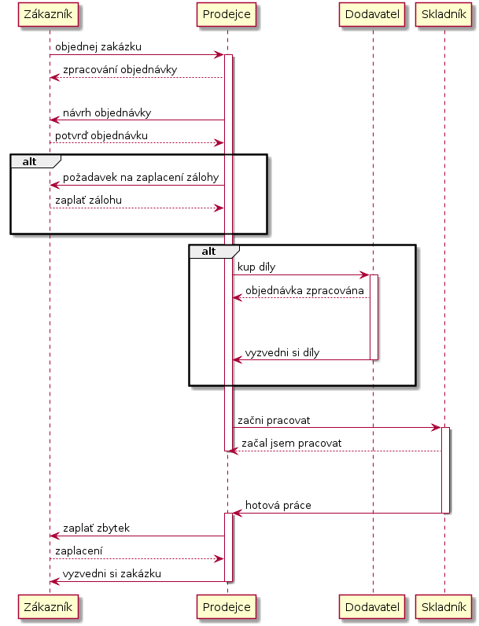
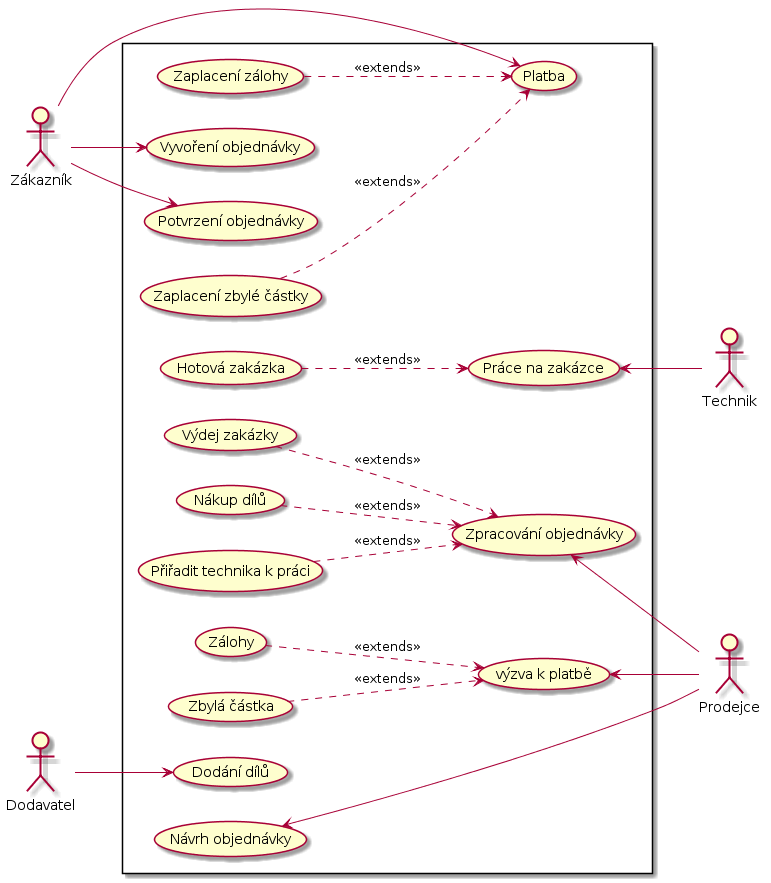
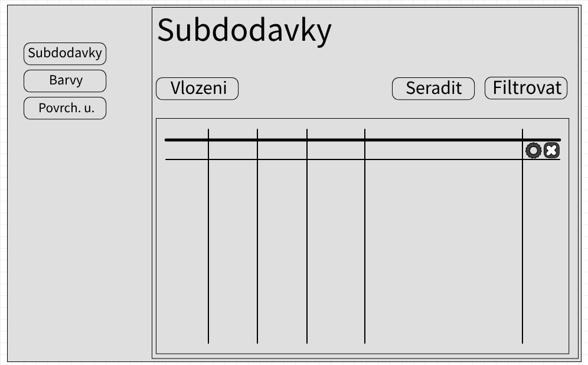
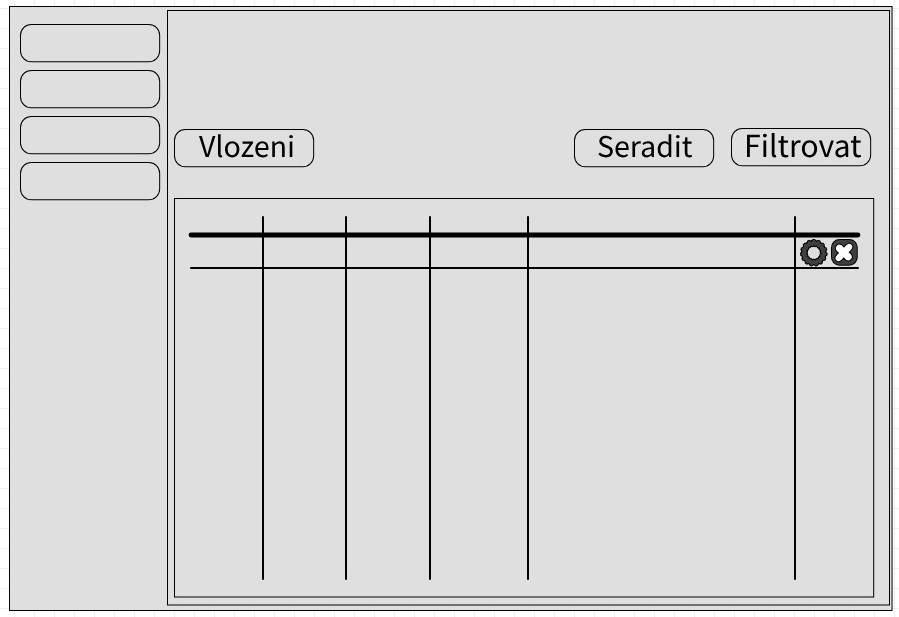
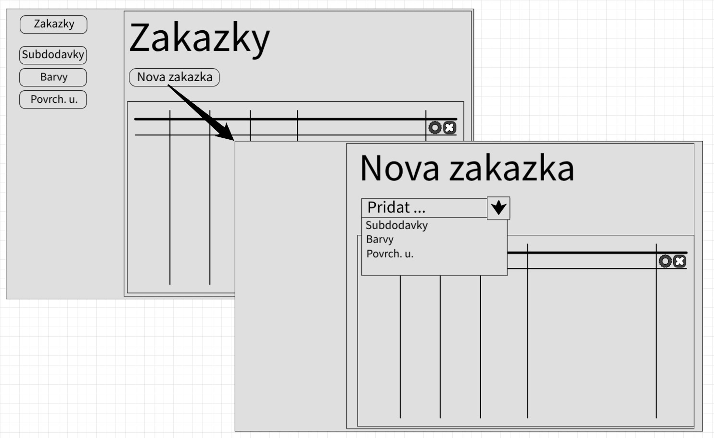
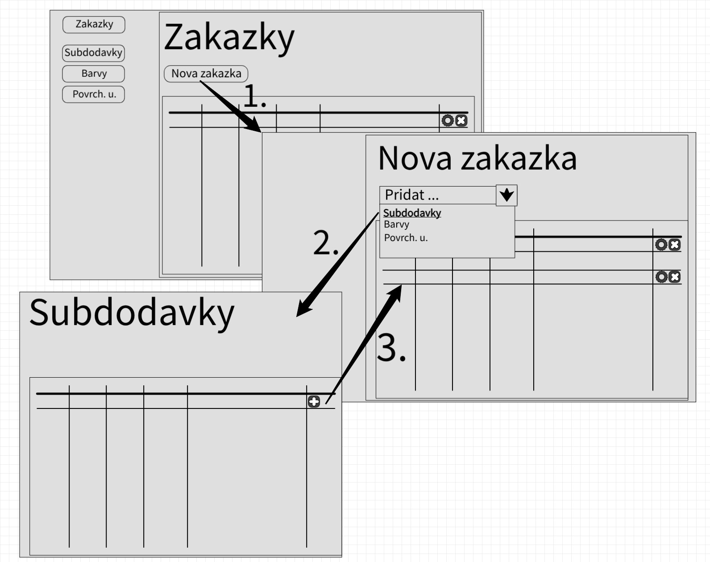

= Jan Tikal - Semestrální projekt

== Scénář

//Objedání zakázky
Zákazník nám předá své údaje (jméno, přijmení, název firmy (údaje spojené s firmou) a kontaktní údaje).
Dále nám popíše o jaké služby má zájem. Například z výběru z níže napsaných:

* Samostatné podvozky k dostavbě určené pro nejrůznější nástavby (provedení podle požadavků zákazníka)
* Nosiče pro všechny typy kontejnerů
** DIN 30722 + vanové kontejnery
** vanové kontejnery + ISO kontejnery
** přeprava kontejnerů + valník
** přeprava kontejnerů + přepravník strojů
* Sklápěčkové podvozky
** Tandemové, točnicové nebo návěsové sklápěcí přívěsy
* Návěsy a přívěsy pro přepravu dřeva
* Odtahovky a přepravníky strojů
* Podvozky pod cisterny
* Traktorové přívěsy
* Speciální přívěsy podle přání zákazníka

Prodejce tyto informace zpracuje a podle požadavků zákazníka zpracuje objednávku. Vytvoří plán objednávky s předběžnou
informační cenou. Poté tuto zpracovanou objednávku přeloží zákazníkovi.

Zákazník tento návrh může přijmout i nemusí. Popřípadě se dořeší další nesrovnalosti.

Do určité výše ceny zakázky je zákazník povinen zaplatit část z této částky předem.

Podle zpracované zakázky prodejce zjistí, které díly je potřeba objednat od dodavatele. Některé díly mouhou být
evidované ve skladu, tyto díly nejsou potřebné obejdnat.

// vyzvedávání dílu od dodavatele
Díly, které jsou dodavatelem dodány, jsou zaevidovány do skladu. Je možno evidovat více dílů/výrobků. Každý z těchto
dílů/výrobků má informace, které ho popisují a charakterizují.

//Dodání dílů
Jakmile jsou všechny díly dostupné, objednávka míří k technikovi, kterou postupem času zpracovává. Prodejce ze skladu
díly, které jsou použity pro stavbů návěsu. Nepoužité skladové zásoby jsou zpetně doplněny do systému. Prodejce má po
celu dobu přehled jak práce na objednávce probíhají.

// technik začne pracovat na objednávce

// požádání o zaplacení zbylé částky
Po vyhotovení práce se předá zákazníkovi požadavek o zplacení.

== Diagramy
=== Sequence diagram
----
@startuml
participant Zákazník

Zákazník -> Prodejce: objednej zakázku

activate Prodejce
    Prodejce --> Zákazník: zpracování objednávky
    |||
    Prodejce -> Zákazník: návrh objednávky
    Zákazník --> Prodejce: potvrď objednávku
alt
    Prodejce -> Zákazník: požadavek na zaplacení zálohy
    Zákazník --> Prodejce: zaplať zálohu
    |||
end

alt
    Prodejce -> Dodavatel: kup díly
activate Dodavatel
    Dodavatel --> Prodejce: objednávka zpracována
    |||
    |||
    Dodavatel -> Prodejce: vyzvedni si díly
deactivate Dodavatel
    |||
end
    |||
    Prodejce -> Skladník: začni pracovat
activate Skladník
    Skladník --> Prodejce: začal jsem pracovat
deactivate Prodejce
    |||
    |||
    Skladník -> Prodejce: hotová práce
deactivate Skladník
activate Prodejce
    Prodejce -> Zákazník: zaplať zbytek
    Zákazník --> Prodejce: zaplacení
    Prodejce -> Zákazník: vyzvedni si zakázku
deactivate Prodejce
@enduml
----

.Sequence diagram

=== Use case diagram
----
@startuml
left to right direction
skinparam packageStyle rectangle

actor Zákazník
actor Prodejce
actor Dodavatel
actor Technik

rectangle {
Zákazník --> (Vyvoření objednávky)
Zákazník --> (Potvrzení objednávky)
Zákazník --> (Platba)
(Zaplacení zálohy) ..> (Platba) : <<extends>>
(Zaplacení zbylé částky) ..> (Platba) : <<extends>>

(Zpracování objednávky) <-- Prodejce
Prodejce -> (Návrh objednávky)
(výzva k platbě) <-- Prodejce
(Zálohy) ..> (výzva k platbě) : <<extends>>
(Zbylá částka) ..> (výzva k platbě) : <<extends>>
(Nákup dílů) ..> (Zpracování objednávky) : <<extends>>
(Přiřadit technika k práci) ..> (Zpracování objednávky) : <<extends>>
(Výdej zakázky) ..> (Zpracování objednávky) : <<extends>>

Dodavatel --> (Dodání dílů)

(Práce na zakázce) <-- Technik
(Hotová zakázka) ..> (Práce na zakázce) : <<extends>>
@enduml
----

.Use case diagram

== Návrh grafického rozhraní

.Grafické rozhraní: Skladu subdodávek

.Grafické rozhraní: Skladu subdodávek/barev/povrchových úprav

.Grafické rozhraní: Vytvoření nové zakázky

.Grafické rozhraní: Vytvoření zakázky a přidávání položek na zakázku

